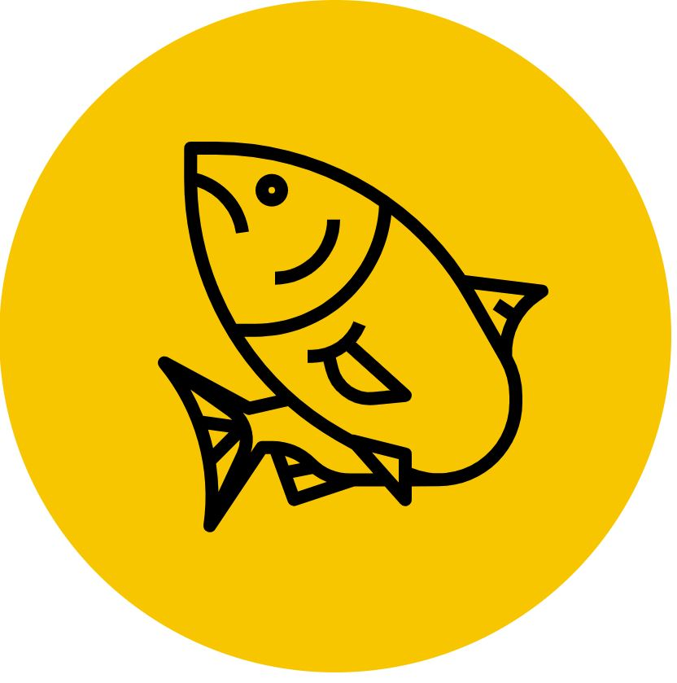

<h1 align="center">
	
</h1>

<h3 align="center">
  Freshly Caught API
</h3>

<p align="center">Awesome projects made by the people of Curacao</p>

<p align="center">
  

  <a href="https://www.linkedin.com/in/eliasgcf/">
    
  </a>
  
  
  
  <a href="https://github.com/EliasGcf/readme-template/commits/master">
    
  </a>
  
  <a href="https://github.com/EliasGcf/readme-template/issues">
    
  </a>
  
  
</p>

<p align="center">
  <a href="#-about-the-project">About the project</a>&nbsp;&nbsp;&nbsp;|&nbsp;&nbsp;&nbsp;
  <a href="#-technologies">Technologies</a>&nbsp;&nbsp;&nbsp;|&nbsp;&nbsp;&nbsp;
  <a href="#-getting-started">Getting started</a>&nbsp;&nbsp;&nbsp;|&nbsp;&nbsp;&nbsp;
  <a href="#-how-to-contribute">How to contribute</a>&nbsp;&nbsp;&nbsp;|&nbsp;&nbsp;&nbsp;
  <a href="#-license">License</a>
</p>

## 👨🏻‍💻 About the project
Freshly Caught started out as a basic idea to promote projects created and being developed by the people of Curacao, wether they are currently living in Curacao or anywhere on the planet, this website contains the projects they're currently working on. To see the **web client**, click here: [freshlycaught.io](https://freshlycaught.io)</br>

## 🚀 Technologies

Technologies that I used to develop this REST API

- [Node.js](https://nodejs.org/en/)
- [TypeScript](https://www.typescriptlang.org/)
- [Express](https://expressjs.com/pt-br/)
- [JWT-token](https://jwt.io/)
- [Jest](https://jestjs.io/)
- [SuperTest](https://github.com/visionmedia/supertest)
- [Eslint](https://eslint.org/)
- [Prettier](https://prettier.io/)


## 💻 Getting started

### Requirements

- [Node.js](https://nodejs.org/en/)
- [Yarn](https://classic.yarnpkg.com/) or [npm](https://www.npmjs.com/)
- One instance of [MongoDB](https://www.mongodb.com/)

I highly recommend using docker for the database instance, you can do this with:

```
$ docker pull mongo
```

**Clone the project and access the folder**

```bash
$ git clone https://github.com/ryhazerus/freshly-caught-api && cd freshly-caught-api
```

**Follow the steps below**

```bash
# Install the dependencies
$ npm install

# Create the instance of mongodb using Docker
$ docker run mongo

# Create the .env file containing the following keys
MONGO_URL=
JWT_KEY=
PORT=

# Start the development server with
$ npm run dev 

# Well done, project is started!
```

## 🤔 How to contribute

**Make a fork of this repository**

```bash
# Fork using GitHub official command line
# If you don't have the GitHub CLI, use the web site to do that.

$ gh repo fork Ryhazerus/freshly-caught-api
```

**Follow the steps below**

```bash
# Clone your fork
$ git clone https://github.com/ryhazerus/freshly-caught-api && cd freshly-caught-api

# Create a branch with your feature
$ git checkout -b my-feature

# Make the commit with your changes
$ git commit -m 'feat: My new feature'

# Send the code to your remote branch
$ git push origin my-feature
```

After your pull request is merged, you can delete your branch

## 📝 License

This project is licensed under the MIT License - see the [LICENSE](LICENSE) file for details.

---

Made with 💜 &nbsp;by Zahyr Seferina 👋 &nbsp;[See my linkedin](https://www.linkedin.com/in/zahyr-seferina-68b315b9/)